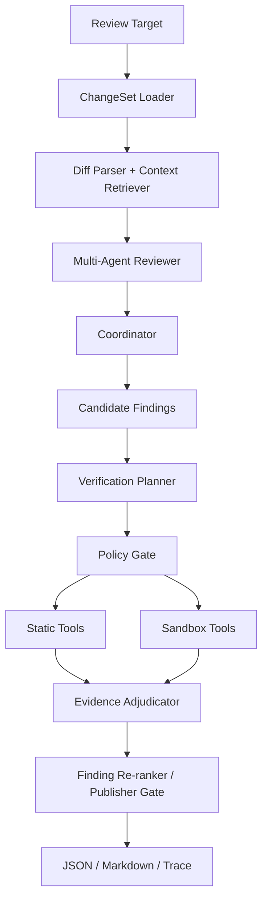

# Version 2.1 Design Report

## Positioning

`v2.1` changes the review pipeline from:

```text
Reviewer -> Validator -> Report
```

to:

```text
Reviewer -> Validator -> Verification Planner -> Policy Gate -> Safe Tools -> Evidence Adjudicator -> Report
```

The goal is not to turn the project into an autonomous coding agent. The goal is to reduce false positives by requiring review findings to carry explicit verification status and evidence.

## Architecture



## Data Model

New schema objects live in `src/pr_agent/review/schema.py`:

- `ToolKind`
- `VerificationStatus`
- `VerificationIntent`
- `VerificationPlan`
- `ToolResult`
- `FindingVerification`

`ReviewFinding` now has:

```python
verification_intent: VerificationIntent | None = None
verification: FindingVerification | None = None
```

The `verification_intent` is advisory. The model can suggest search terms or preferred tools, but it cannot provide raw shell commands or Docker configuration.

## Planning And Policy

The planner creates a conservative plan from the finding category, file path, evidence text, and test suggestions. The policy gate then applies deterministic restrictions:

- `bug`: repository search, read file, test discovery, pytest, ruff, mypy.
- `test`: repository search, test discovery, pytest.
- `security`: repository search, read file, dependency inspection, ruff.
- `performance`: repository search, read file, test discovery.

`static` mode removes execution tools. `sandbox` mode allows only approved execution templates.

## Evidence Adjudication

The adjudicator returns one of:

- `supported`: evidence clearly supports the finding, usually through a failing targeted check.
- `contradicted`: evidence clearly refutes the finding, such as an absolute missing-test claim where related tests exist.
- `inconclusive`: evidence is insufficient. Passing unrelated tests never proves a bug does not exist.

Publication decisions:

- `supported` -> publish, confidence increases.
- `contradicted` -> suppress, confidence becomes `0.0`.
- `inconclusive` -> high-severity/high-confidence findings publish with warning; medium/low signal findings suppress by default.

## CLI

Review with verification:

```powershell
pr-agent review local --out outputs/local --verify static --workspace . --verification-budget 3 --verification-timeout 45
```

Standalone verification:

```powershell
pr-agent verify outputs/local/review_result.json --workspace . --mode static --out outputs/verified
```

## Outputs

The normal outputs remain:

- `review_result.json`
- `review_report.md`
- `trace.jsonl`

v2.1 also writes:

- `verification_report.json`
- `artifacts/verification/<finding-id>/search_result.json`
- `artifacts/verification/<finding-id>/test_discovery.json`
- `artifacts/verification/<finding-id>/tool_result.json`
- sandbox logs such as `pytest.log`, `ruff.log`, or `mypy.log`

## Compatibility

`--verify off` is the default and preserves v2 behavior. Existing review JSON remains readable because verification fields are optional.

